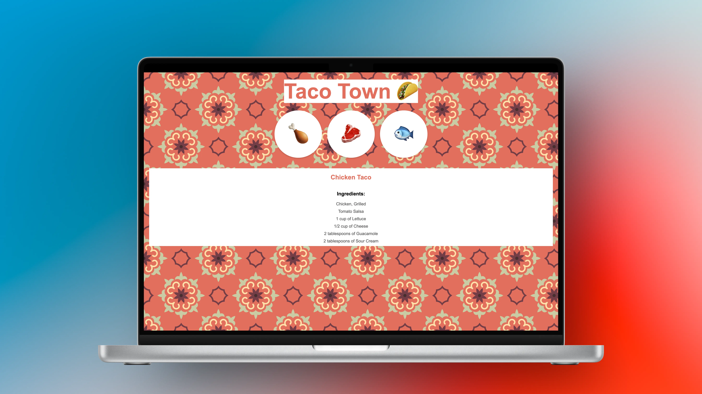

# Taco Town

Interactive recipe web app built with **Node.js**, **Express**, and **EJS**, allowing users to select their favorite tacos and view detailed recipes in real-time.

<p align="center">
  
</p>

<br>

---

## Tech Stack

- **Backend:** Node.js, Express
- **Templating:** EJS
- **Styling:** CSS
- **Middleware:** body-parser
- **Data:** JSON

<br>

---

## Features

- Select from **Chicken, Beef, or Fish tacos** and view corresponding recipes.
- Dynamic rendering of recipes using **EJS templates**.
- Structured recipe data stored in **JSON**, including ingredients, preparation, and toppings.
- Responsive and user-friendly interface.

<br>

---

## Requirements

- **Node.js** (v14 or higher recommended)
- **npm** (comes with Node.js)
- A modern web browser (Chrome, Firefox, Edge, etc.)

<br>

---

## How to Use

1. Open the app in your browser at http://localhost:3000.
2. Select a taco type (Chicken, Beef, or Fish) from the menu.
3. Click the Submit button to view the detailed recipe.
4. Review the ingredients, protein preparation, salsa, and toppings.
5. Repeat the selection to view other taco recipes.

<br>

---

## Installation

1. Clone the repository:

```bash
git clone https://github.com/MustafaHabibX/taco-town.git
```

2. Navigate to the project folder:

```bash
cd taco-town
```

3. Install dependencies:

```bash
npm install
```

4. Start the server with Node:

```bash
node index.js
```

5. Open your browser at:

```
http://localhost:3000
```

<br>

---

## Learning Outcomes

- Gained hands-on experience with **Node.js** and **Express** for server-side development.
- Learned to use **EJS templates** for dynamic HTML rendering.
- Practiced handling **JSON data** and integrating it into a web application.
- Implemented **form handling** and routing for user interactions.
- Developed skills in creating a **responsive and user-friendly interface** using HTML and CSS.
- Strengthened understanding of **full-stack JavaScript application structure** and workflow.

<br>
